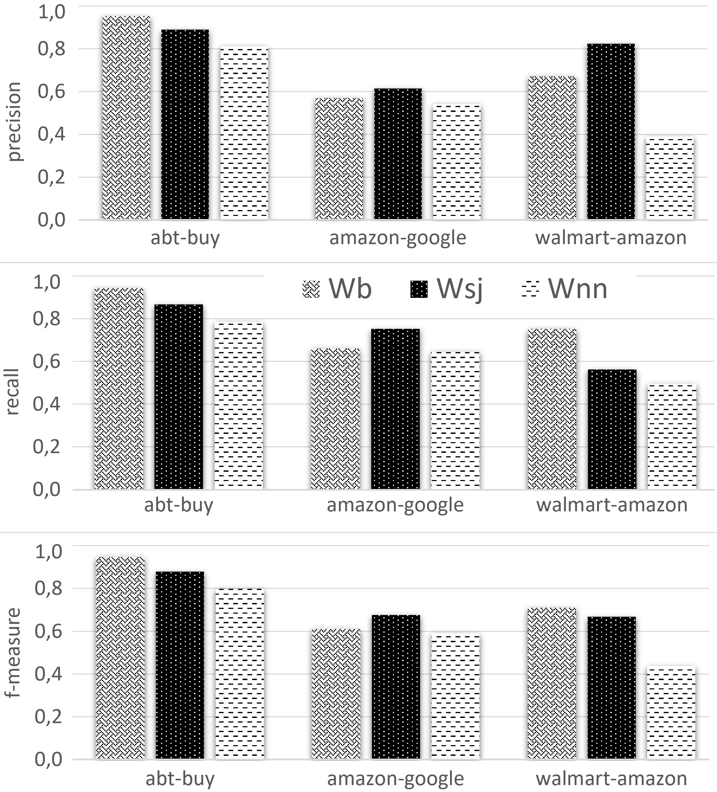
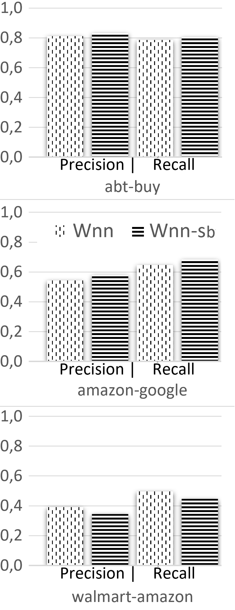

# pyJedAI: A Library with Resolution-related Structures and Procedures for Products

This project is distributed in association with the [INFORMS Journal on Computing](https://pubsonline.informs.org/journal/ijoc) under the [Apache 2.0 License](LICENSE).

The software and data in this repository are associated with the paper [pyJedAI: A Library with Resolution-related Structures and Procedures for Products](https://doi.org/10.1287/ijoc.2023.0410) by Ekaterini Ioannou, Konstantinos Nikoletos and George Papadakis. 

## Version

The version used in the paper is

[](https://github.com/AI-team-UoA/pyJedAI/releases/tag/0.1.7)

## Cite

To cite this software, please cite the [paper](https://doi.org/10.1287/ijoc.2023.0410) and the software, using the following DOI.

[](https://zenodo.org/badge/latestdoi/285853815)

```
@misc{pyjedaiProductMatching,
  author =        {Ekaterini Ioannou, Konstantinos Nikoletos, George Papadakis},
  publisher =     {INFORMS Journal on Computing},
  title =         {pyJedAI: A Library with Resolution-related Structures and Procedures for Products},
  year =          {2024},
  doi =           {10.1287/ijoc.2023.0410.cd},
  note =          {Available for download at https://github.com/INFORMSJoC/2023.0410},
}
```

## Authors

- [Ekaterini Ioannou](https://www.tilburguniversity.edu/staff/ekaterini-ioannou), Assistant Professor at Tilburg University, The Netherlands 
- [Konstantinos Nikoletos](https://nikoletos-k.github.io), Research Associate at University of Athens, Greece
- [George Papadakis](https://gpapadis.wordpress.com), Senior Researcher at University of Athens, Greece

## Description

This work presents an open-source Python library, named pyJedAI, which provides functionalities supporting the creation of algorithms related to Product Entity Resolution. Building over existing state-of-the-art resolution algorithms (Papadakis et al. 2021a), the tool offers a plethora of important tasks required for processing product data collections. It be can easily used by researchers and practitioners for creating algorithms analyzing products, such as real-time ads bidding, sponsored search, or pricing determination. In essence, it allows to easily import product data from the possible sources, compare products in order to detect either similar or identical products, generate a graph representation using the products and desired relationships, and either visualize or export the outcome in various forms. Our experimental evaluation on data from well-known online retailers illustrates high accuracy and low execution time for the supported tasks. To the best of our knowledge this is the first Python package to
focus on product entities and provide this range of Product Entity Resolution functionalities. 

## Building

In Linux, to build the version used for this paper, execute the following commands.

Create a conda environment with Python 3.9 or 3.10:
```
conda create --name product_matching_env python==3.9
```

You can either 
```
pip install pyjedai==0.1.7
```

or in the root directory
```
git clone https://github.com/AI-team-UoA/pyJedAI.git
pip install . 
```

## Results

The performance and plots used in paper of each approach can be found in `results` directory.

<span>
  
  
 </span>


## Replicating

The simplest way to reproduce and view the results of this paper, is using the Colab notebook

__Google Colab Hands-on demo:__ 

<div align="center">
    <a href="https://colab.research.google.com/drive/1VB_DfIT3eLXhlg6vGZSCWrJKc7AcLIpA?usp=sharing">
         
    </a>
</div>

Alternatively first run the installation and then go to `src` directory and run:

- **Blocking workflow**: `python blocking_workflow.py --dataset 'Abt - Buy'`
- **Similarity joins workflow**: `python similarity_joins_workflow.py --dataset 'Amazon - Google Products'`
- **NN workflow**: `python nn_workflow.py --dataset 'Abt - Buy' --schema 'schema-agnostic' `

where for
- `--dataset` flag, available values are `{'Abt - Buy', 'Amazon - Google Products', 'Wallmart - Amazon' }` and for
- `--schema` flag `{'schema-agnostic', 'schema-based'}`, available only for the NN workflow.

For the scalability test:

```
python dbpedia_scalability.py
```

## Ongoing Development

This main tool is being developed on an on-going basis at the author's
[Github site](https://github.com/AI-team-UoA/pyJedAI).

## Documentation page

To view more examples of this software visit [readthedocs](https://pyjedai.readthedocs.io/en/latest/intro.html) website. 

## Support

For support in using this software, submit an
[issue](https://github.com/AI-team-UoA/pyJedAI/issues/new).
